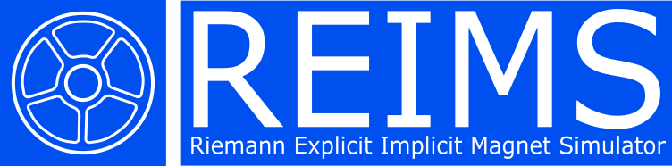

# REIMS — Riemann Explicit Implicit Magnet Simulator

REIMS performs thermo-hydraulic simulation of superconducting magnets cooled by supercritical helium. It solves compressible single-phase flow with a real gas equation of state in the Cable-In-Conduit-Conductors and the associated pipe network. The fluid exchanges heat with the surrounding solid structure, in which conduction is solved simultaneously. Operating scenarios are imposed as inputs: electric current and magnetic field, together with static and dynamic heat loads such as nuclear heating, AC losses and eddy current losses. All these equations are assembled in a single sparse system integrated in time, with automatic selection between explicit and implicit time stepping, which lets the code run at least an order of magnitude faster than real time. The code is used for plasma pulse scenario validation, where it predicts the temperature margin before quench, and also for cool-down and quench propagation analyses.

- Project started: January 2020
- Version 2.0 started: November 2023
- Version 2.1 started: October 2025

---

- **Published documentation:** [Home](https://iterorganization.github.io/REIMS/)
- **Published user manual:** [HTML](https://iterorganization.github.io/REIMS/user/_build/html/index.html), [PDF](https://iterorganization.github.io/REIMS/user/_build/latex/reims.pdf)
- **Published DLL developer guide:** [HTML](https://iterorganization.github.io/REIMS/dll/_build/html/index.html), [PDF](https://iterorganization.github.io/REIMS/dll/_build/latex/reimsdlldeveloperguide.pdf)
- **Published FORD reference:** [HTML](https://iterorganization.github.io/REIMS/ford_generated/index.html)
- **Published JSON schema:** [JSON](https://iterorganization.github.io/REIMS/tools/reims_schema.json)

- **User manual:** [PDF](docs/user/_build/latex/reims.pdf)
- **DLL developer guide:** [PDF](docs/dll/_build/latex/reimsdlldeveloperguide.pdf)

---

## How to cite REIMS

> D. Furfaro, J. Kosek, A. Ovcharov, T. Schioler, R. Rotella, T. Luce,
> *A new fast and robust thermo-hydraulic code for ITER superconducting magnet simulation*,
> Cryogenics, Volume 144, 2024, 103978

---

## License and authors

Copyright (c) 2020–2026 Damien Furfaro & Jacek Kosek

This software is distributed under the
[GNU Lesser General Public License v2.0 or later](LICENSE) (LGPL-2.0-or-later).
